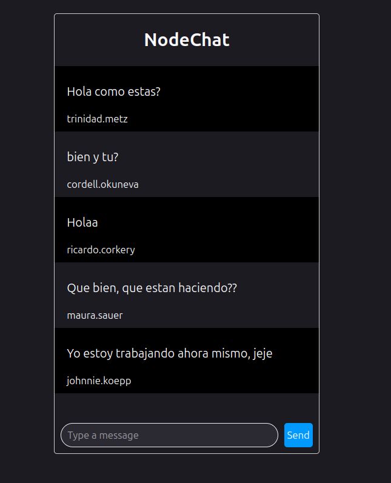

# Chat Web en Tiempo Real

Este proyecto es una implementación de un chat web en tiempo real utilizando **Node.js**, **Socket.io**, **SQL**, **HTML** y **CSS**.

## Vista Previa

## Tecnologías Utilizadas

- Node.js
- Socket.io
- SQL
- HTML
- CSS